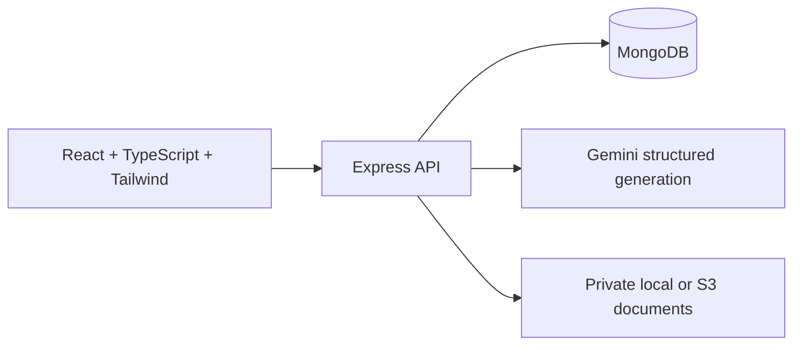

# MELO — AI Test Case Generator

Assessment: ingest requirements, generate a structured suite, review workflows/rules/user stories/test cases, persist edits and decisions, and export an Excel workbook.

## Run locally

Prerequisites: Node.js 22.13+ (tested on Node 22), npm, and MongoDB (local or Atlas). A Google AI API key is required for real generation. Document uploads use private local storage by default and can use S3 in deployment.

1. Install dependencies:

   ```sh
   cd server -> npm i
   cd client -> npm i
   ```

2. Copy `server/.env.example` to `server/.env` and `client/.env.example` to `client/.env.local`. In PowerShell:

   ```powershell
   Copy-Item server/.env.example server/.env
   Copy-Item client/.env.example client/.env.local
   ```

   Preserve an existing `.env` if it already contains your configuration. Set `MONGODB_URI`, `GEMINI_API_KEY`, and a random `JWT_SECRET` of at least 32 characters. Generate a secret with:

   ```sh
   node -e "console.log(require('node:crypto').randomBytes(48).toString('hex'))"
   ```

   `GEMINI_MODEL` defaults to `gemini-3.6-flash`, with `GEMINI_FALLBACK_MODEL=gemini-3.5-flash-lite` used for model-specific quota and temporary availability failures. Change them to models available to your Google AI account. Keep all secrets on the server. Vite variables are public and must never contain credentials.

3. Start the API in one terminal and the client in another:

   ```sh
   cd server/ npm run dev
   cd client/ npm run dev
   ```

   Open <http://localhost:5173>. The API runs on <http://localhost:5000/api>; `/api/health` checks HTTP availability. Vite proxies `/api` locally. If Vite chooses another port, set `CLIENT_ORIGIN` and `APP_URL` accordingly.

4. Create an account using **Create an account** on the login page. No seed credentials are required.

## End-to-end flow

1. **Landing and project creation:** enter a software requirement or attach a PDF/TXT document; choose a project name. The original text is saved when the project is created. If upload fails after creation, retry the upload or continue to the existing project without creating duplicates.
2. **Context:** refine the original requirement, add additional instructions, and upload up to five documents. Original text, additional context, and extracted documents are combined for AI generation; new context does not replace earlier input. Uploads accept at most 5 MB each, documents at most 50,000 extracted characters, and combined context at most 80,000 characters. Scanned PDFs need OCR outside this application.
3. **Design:** choose a category, technique, and Standard / BDD (Gherkin) / BDD 2.0 format. BDD 2.0 is interpreted as Given/When/Then scenarios with concrete example data. Saved settings load when reopening the page. Optional prompt instructions are included in the generation request.
4. **Generate:** the backend requests a JSON-schema-constrained suite from Gemini and validates it again with Zod. The suite contains related workflows, business rules, user stories, and test cases spanning positive, negative, edge, and validation scenarios.
5. **Review:** navigate the five review stages. Expand items, inspect a workflow's rule/scenario map, search, select, edit, delete, approve, reject, or mark selected items as explicit. Workflow deletion cascades to its linked rules/stories/cases. Review stages remain directly navigable; approval is not an artificial navigation barrier.
6. **Save and retrieve:** edits and review actions are persisted immediately. Editing approved content returns that item to pending review. Refresh the page or reopen it from Projects to retrieve the saved state. When all remaining test cases are approved, the project is marked completed.
7. **Regenerate:** optionally provide feedback. Confirm replacement of the current suite. Existing results remain saved until a new validated suite is ready; provider failures do not erase them.
8. **Export:** download selected or all test cases as `.xlsx`, including workflow, title, type, preconditions, steps, expected results, and review status.

## Architecture and decisions



- **Client:** route-based lazy loading, reusable composer/dialog/review/editor components, a shared Axios client, and an abortable project-loading hook. Local state handles drafts and selection; the API is the source of truth for persisted data. API errors are displayed inline, and a React error boundary offers recovery from unexpected rendering failures.
- **Backend:** routers dispatch to controllers; reusable validation, ownership checks, document extraction, S3 operations, and AI logic are separate modules. Express 5 async errors flow into a centralized JSON error handler. File, malformed JSON, validation, database conflict, authentication, and provider failures produce controlled responses.
- **Data model:** Users store normalized email, a bcrypt password hash, session version, and hashed expiring password-reset tokens. Projects own context, attachments, design, and embedded review collections. Each rule, story, and case references its workflow ID. Embedding keeps the bounded suite together and supports atomic saves without a multi-document transaction. An index on owner/update time supports paginated project retrieval.
- **Concurrency:** Mongoose optimistic concurrency detects conflicting edits. Generation uses an atomic token/lease and increments the document version. Concurrent generation and content edits during generation are rejected. A four-minute expired lease is recovered when the project is accessed, so interrupted servers do not leave projects permanently stuck.
- **AI strategy:** prompts distinguish requirement data from instructions, request grounded rules and observable outcomes, identify assumptions, and apply the selected technique. A constrained JSON schema is followed by runtime checks for required fields, nonempty steps, unique case titles, bounds, and four-dimensional coverage. Temporary provider errors and malformed suites receive at most two retries with backoff. Calls have timeouts; failed requests preserve saved work. Schema validation cannot establish semantic correctness: human review remains essential.
- **Security:** ownership is checked on every project operation. JWTs expire after one hour, and token versions revoke sessions on logout. Tokens live in browser session storage, which avoids persistence across browser sessions but requires continued care against XSS. Auth/API/generation endpoints are rate limited; CORS has an explicit allowlist; Helmet sets API security headers. The in-process rate limiter is appropriate for a single API instance; multiple instances require a shared store.
- **Performance:** project lists are paginated and exclude full suites/documents; generation payloads and counts are bounded; MongoDB connections use a pool; pages and icons are bundled into route chunks. One generation request persists the entire suite. No external AI, email, or storage keys reach the client.

## Document storage and AWS S3 setup

For local development, set `STORAGE_DRIVER=local` and `LOCAL_UPLOAD_DIR=uploads`. Files are stored privately under `server/uploads` when the server is started through the provided npm scripts. Downloads pass through the authenticated API, and the directory is excluded from Git. Local files are temporary application data: back them up if needed and do not use local mode on ephemeral hosting.

When AWS is ready, set `STORAGE_DRIVER=s3`, then configure the values below. Existing local attachment records remain readable from local disk after the switch because local keys identify their storage provider; new uploads use S3.

Create a **private bucket** with Block Public Access enabled. Configure `AWS_REGION` and `S3_BUCKET`. Use an IAM role in deployment; for local work, configure the standard AWS credentials/profile or server-only `AWS_ACCESS_KEY_ID` and `AWS_SECRET_ACCESS_KEY`.

The API identity needs `s3:PutObject`, `s3:GetObject`, and `s3:DeleteObject` on `arn:aws:s3:::YOUR_BUCKET/requirements/*`. Uploaded objects use opaque keys scoped by user/project and AES256 server-side encryption. Downloads require project ownership and return a signed URL valid for 60 seconds. Browser-to-S3 upload CORS is unnecessary because uploads pass through the API. S3 and MongoDB are not transactional: failed saves trigger best-effort upload cleanup; failed cleanup is logged and should be reconciled operationally. Configure bucket lifecycle rules for noncurrent versions if versioning is enabled.

When `STORAGE_DRIVER=s3` lacks its required configuration, the upload UI returns a useful error and text input remains available.

## Build and deploy

```sh
npm --prefix server run build
npm --prefix client run build
npm --prefix server start
```

Serve `client/dist` with an SPA fallback to `index.html`, and reverse-proxy `/api` to Node. Configure HTTPS, `CLIENT_ORIGIN`, `APP_URL`, and server secrets in your host's environment. Set `TRUST_PROXY=1` only behind one trusted reverse proxy. Allow at least 210 seconds for upstream generation requests. Set `VITE_API_BASE_URL=/api` for same-origin hosting; Vite embeds this at build time. Configure security headers for static frontend hosting separately from the API. QA/production example environment values use `/api` rather than nonexistent example domains.

## Verification

```sh
npm --prefix server test
npm --prefix client run lint
cd client
npx playwright install chromium
npm test
```

Backend integration tests start an isolated temporary MongoDB database; the first run may download MongoDB. They cover validation, ownership, context preservation, upload boundaries/S3 calls, generation, edits, approvals, Excel data, cascade deletion, concurrency, failure preservation, password-reset token reuse, revocation, and JSON errors. External Gemini/S3 calls are mocked: these tests never use your real database or incur AI/storage charges.

Playwright starts Vite on port 5174 and exercises frontend flows using deterministic API fixtures: desktop input/upload/generation/review/edit/reload/export; mobile overflow and error recovery; signup validation and login. Screenshots and traces are written to ignored `client/test-results`. These verify the client separately from the live external integrations. Real Gemini account/model availability, AWS permissions, and final hosting must be smoke-tested with deployment configuration.

## Design scope

The supplied screenshots guide the dark icon rail, MELO wordmark, pink accent, gradient orb, cyan/pink dotted workspace, compact cards, review hierarchy, bulk toolbar, and expandable workflow view. CSS and SVG reproduce the visible design without requiring remote assets. Responsive layouts adapt the fixed desktop reference to mobile. Original Figma vector/font/photo assets were not provided, so this is a screenshot-based implementation, not a claim of pixel-perfect asset identity. Auxiliary integrations are clearly shown as not connected; unrelated menu applications are outside the assessment flow.

The workflow map represents relationships between the generated workflow, rules, and scenarios; it is not an invented execution graph or a connected external knowledge base. Approval/explicit labels represent human review decisions.

Implementation references: [Gemini structured output](https://ai.google.dev/gemini-api/docs/structured-output), [Tailwind with Vite](https://tailwindcss.com/docs/installation/using-vite), [AWS SDK S3 examples](https://docs.aws.amazon.com/sdk-for-javascript/v3/developer-guide/javascript_s3_code_examples.html).
